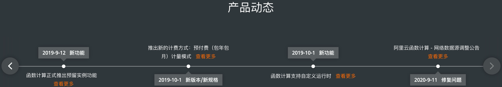
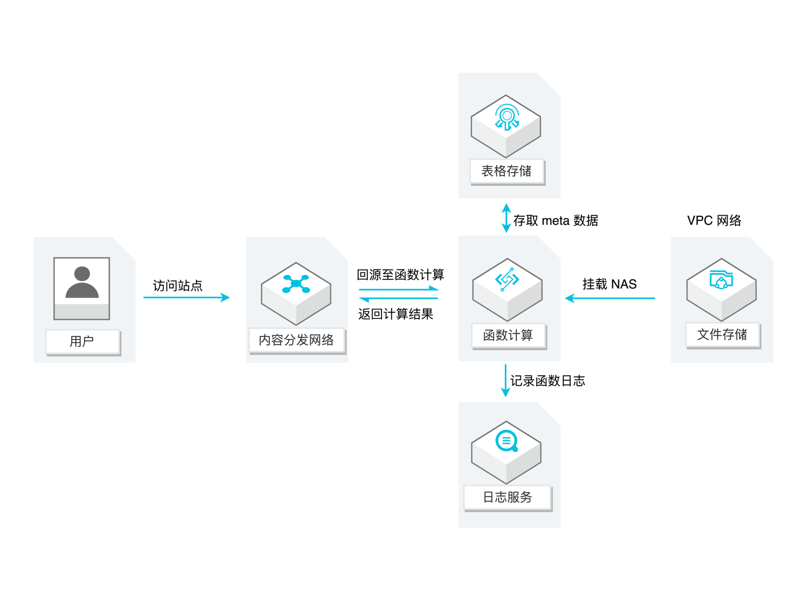
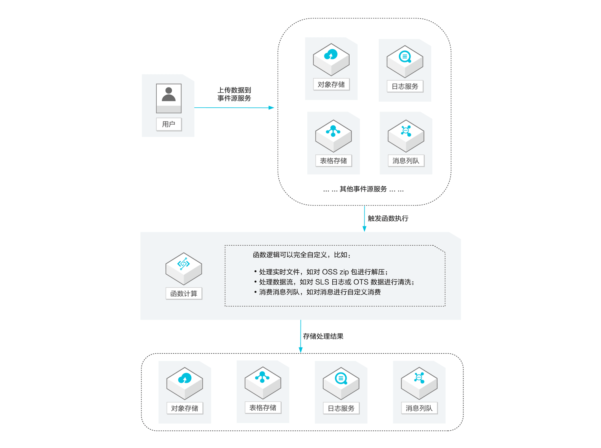
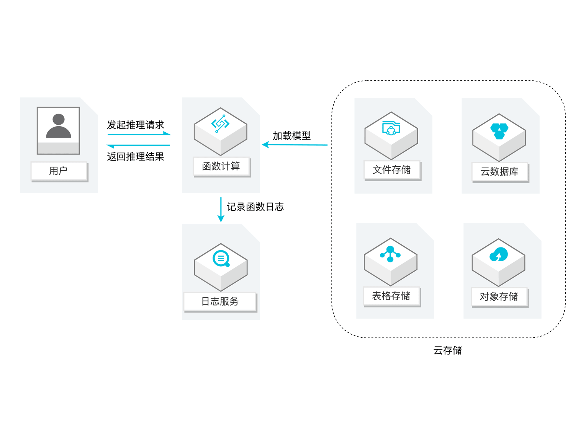
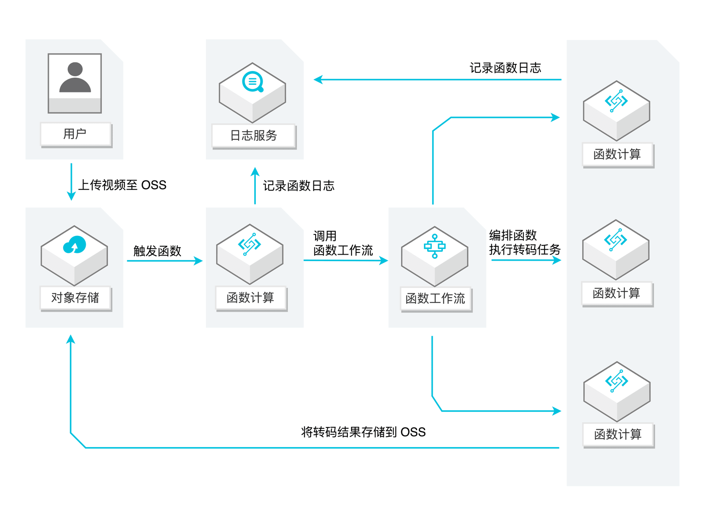

[官网地址](https://www.alibabacloud.com/zh/products/function-compute)

# 功能列表

阿里云函数计算提供的功能有：

* 丰富的触发器类型
	* 阿里云各种产品触发器，如对象存储、日志服务、消息队列、CDN
	* Http 触发器
	* 时间触发器
* 多种编程语言支持
	* Node.js
	* Python
	* Java
	* PHP
	* C#
	* Custom Runtime
* 便捷的开发工具
	* [funcraft](https://github.com/alibaba/funcraft)：阿里自研的开发、构建、部署工具
	* VSCode 插件
* 丰富的资源类型
 	* 按量实例：根据请求数动态扩缩
	* 预留实例：针对冷启动的绕过方案
* 灵活的计量模式
	* 后付费模型：按实际使用计算资源计费
	* 预付费（包年包月）模型

# 产品更新

更新内容反映的是产品迭代的方向

截至 2020.09，阿里云函数计算 release note：

从上图可以看出，函数计算产品在 19 年还是更新的比较频繁，自 19.10 之后就没有新功能上线了

# 使用场景

使用场景是公司内外对产品形态的预期

阿里云给出的使用场景如下：

| 场景 | 案例描述 |
|-----|--------|
| Web 应用 |  |
| 实时数据处理 |  |
| AI 推理 |  |
| 视频转码 |  |

# 重点功能

## 冷启动

官方文档：[函数计算冷启动优化最佳实践](https://www.alibabacloud.com/help/zh/doc-detail/140338.htm?spm=a2c63.l28256.a3.52.c3bb3b2a9CGB5F)

阿里云提供的冷启动优化主要是预留实例，其它的都是对开发者的一些建议，如使用定时触发器预热函数；使用 Initializer 函数入口，函数计算会异步调用初始化接口