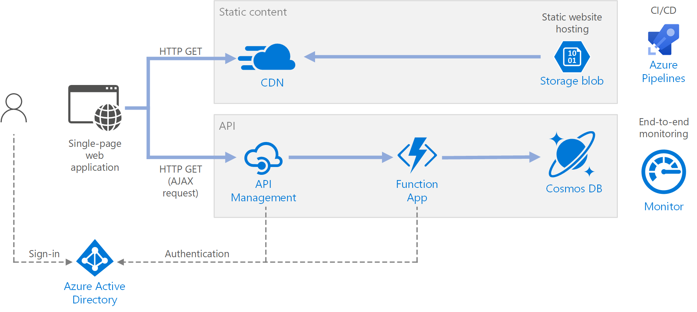
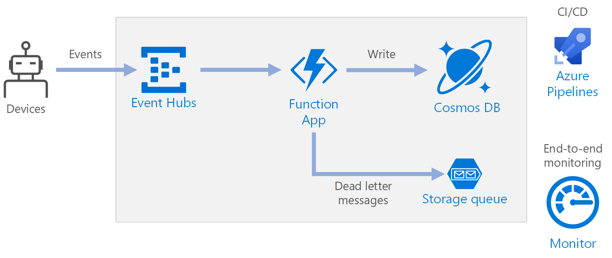

[官网地址](https://azure.microsoft.com/zh-cn/services/functions/)

# 功能列表

Azure Functions 功能（[原文描述](https://azure.microsoft.com/zh-cn/services/functions/#features)）：

* 改进端到端开发体验：Azure 提供了完整的函数开发（Visual Studio）、CI/CD（Azure pipeline）、监控（Azure Monitor）工具
* 简化复杂的业务流程挑战解决方案：引入了有状态函数的概念，详见[Durable Functions](https://docs.microsoft.com/zh-cn/azure/azure-functions/durable/durable-functions-overview?tabs=csharp)，目前仅支持 C#、JavaScript、Python、F# 和 PowerShell
* 在无需硬编码集成的情况下连接其他服务，以更快地开发解决方案：即 “Azure 服务事件触发” + “函数内使用 Azure 服务”
* 构建一次，随处部署：支持部署到 Azure、部署了 KEDA 的 kubernetes 集群等等
* 按你自己的方式进行开发：即支持多种编程语言

# 产品更新

Azure Functions release note：https://azure.microsoft.com/zh-cn/updates/?product=functions

截至 2020.09，相关的更新可以归纳为：

| 更新时间 | 更新内容 | 具体 |
|---------|--------|-----|
| 2020.09.22 | 编程语言支持 | Blazor and C# APIs now supported in Azure Static Web Apps |
| 2020.09.22 | 安全相关更新 | Azure Communication Services now available in public preview |
| 2020.09.02 | Durable Function 更新 | Durable Functions v2.3 现已发布 |
| 2020.08.19 | 编程语言支持 | PowerShell support in Durable Functions is in public preview |
| 2020.07.21 | 编程语言支持 | Java 11 for Azure Functions 现已推出预览版 |
| 2020.07.21 | 安全相关更新 | OpenID Connect support for Azure App Service and Azure Functions (in preview) |
| 2020.06.24 | 编程语言支持 | Durable Functions 现支持 Python |
| 2020.05.19 | nit（网站更新）| Azure Functions 的新门户体验 |
| 2020.04.27 | 编程语言支持 | Azure Functions - 现支持在 Linux 上使用 Java 8 |
| 2020.03.24 | 函数集成 Azure 服务 | Azure Functions 高级计划区域虚拟网络集成 |

Azure 的改动也比较常规，除了对 Durable Function 的持续投入

# 使用场景

| 场景 | 案例描述 |
|-----|--------|
| 无服务器 API | 具有 Node.js 或 Microsoft .NET 的无服务器 API |
| Web 应用程序 |  |
| 微服务 |  |
| 机器学习 | 具有无服务器体系结构的机器学习工作流 |
| 数据处理 |  |
| 云自动化 |  ||

# 重点功能

## 冷启动

官方文档：[了解和解决冷启动](https://docs.microsoft.com/zh-cn/azure/architecture/serverless-quest/functions-app-operations#understand-and-address-cold-starts)

Azure Functions 对冷启动的优化主要是靠[托管计划](https://docs.microsoft.com/zh-cn/azure/azure-functions/functions-scale)，本质上与阿里云预留实例一样。其它的都是建议性质的，如在函数应用中尽量使用异步操作
>>>>>>> af59292... 增加各大主流云厂商冷启动相关的说明
