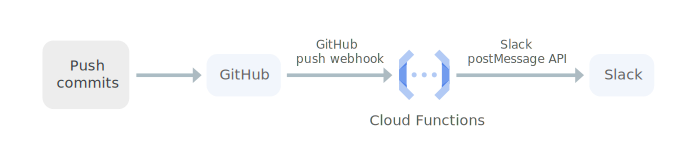
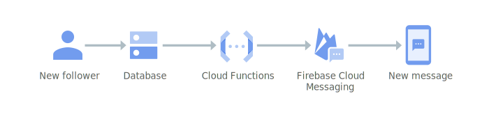
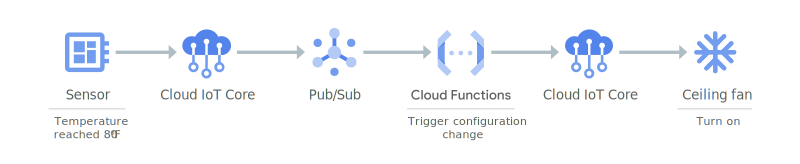
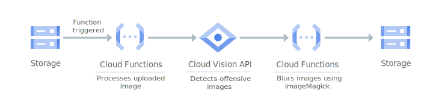
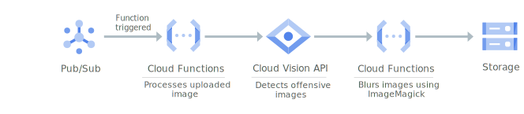
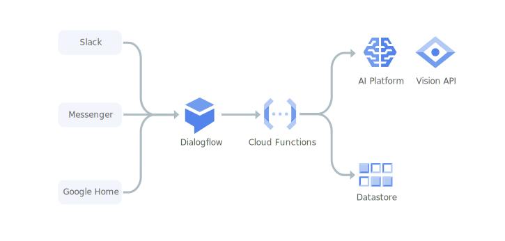
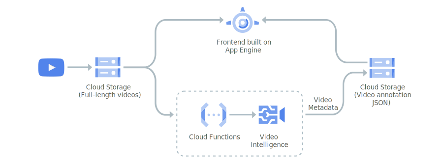
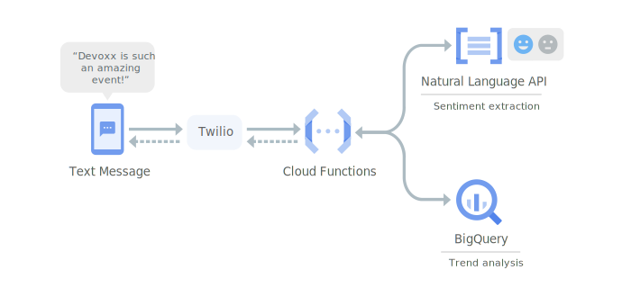

[官网地址](https://cloud.google.com/functions/)

# 功能列表

Google cloud functions 功能（[原文描述](https://cloud.google.com/functions#section-14)）：

* 连接和扩展服务以构建复杂应用：即函数内使用 Google 服务
* 端到端开发和可诊断性：从代码到部署，都具备集成的监控功能。利用 Cloud Trace 和 Cloud Debugger 使您的应用具备全面的可监测性和可诊断性
* 自动扩缩：即基于负载的自动扩缩
* 无需管理服务器
* 运行代码以响应事件：即 Google 服务事件触发
* 用多少、付多少
* 采用开源技术，避免供应商锁定：基于 [Knative](https://coldtea214.gitbook.io/cncf-serverless/installableplatform/knative)

# 产品更新

Google cloud functions release note：https://cloud.google.com/functions/docs/release-notes

截至 2020.09，相关的更新可以归纳为：

| 更新时间 | 更新内容 | 具体 |
|---------|--------|-----|
| 2020.08.26 | 编程语言支持 | Node 10 runtime now builds container images in the user's project... |
| 2020.08.14 | 编程语言支持 | now supports Java 11 at the General Availability release level |
| 2020.08.05 | 编程语言支持 | Java 11, Python 3.7 or 3.8, and Go 1.13 runtimes now build container images in the user's project... |
| 2020.07.31 | nit（功能上线新机房）| Cloud Functions is now available in the following regions... |
| 2020.07.23 | 函数集成 Google 服务 | Serverless VPC Access support for Shared VPC is now available in Beta |
| 2020.07.15 | 编程语言支持 | has added support for a new runtime, Node 12, in Beta... |
| 2020.07.07 | 函数集成 Google 服务 | allows you to use Cloud CDN and Cloud Armor with Google Cloud Functions... |
| 2020.06.05 | 编程语言支持 | Node.js 8 runtime is deprecated as of 2020-06-05... |
| 2020.05.28 | 编程语言支持 | now supports Go 1.13 at the General Availability release level |
| 2020.03.31 |  函数集成 Google 服务 | now supports Connecting to Cloud SQL at the General Availability release level... |

Google 近期的改动也比较常规

# 使用场景

| 场景 | 案例描述 |
|----|--------|
| 与第三方服务及 API 集成 |  |
| 无服务器移动后端 |  |
| 无服务器 IoT 后端 |  |
| 实时文件处理 |  |
| 实时流处理 |  |
| 虚拟助理和对话式体验 |  |
| 视频和图片分析 |  |
| 情感分析 |  |

# 重点功能

## 冷启动

官方文档：[最佳实践-提示与技巧](https://cloud.google.com/functions/docs/bestpractices/tips)

这篇文档是全局的一些最佳实践，冷启动是其中的一部分。Cloud Functions 针对冷启动的优化都是些建议性质的
