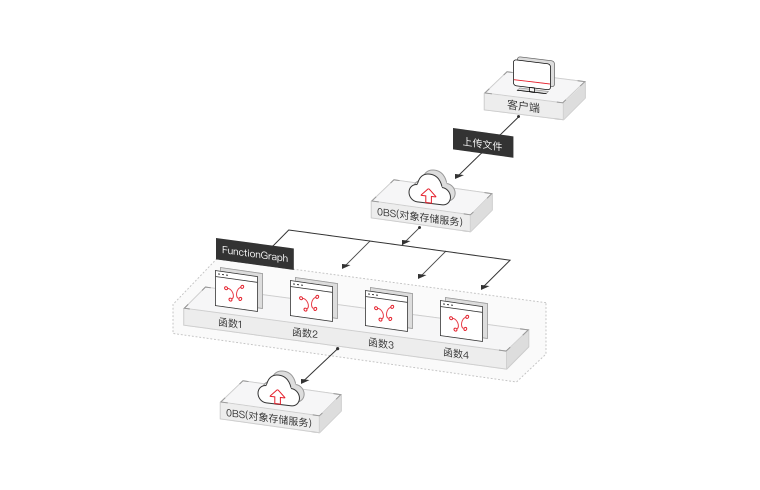
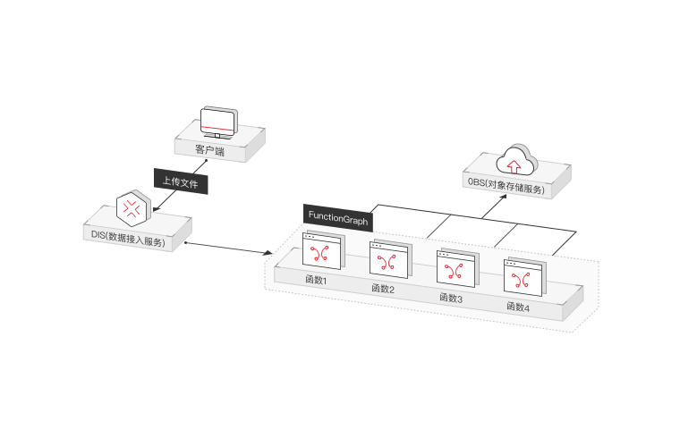
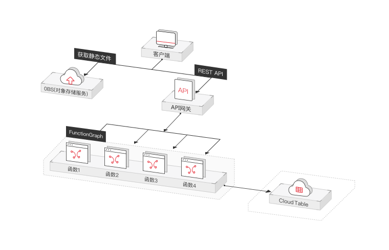
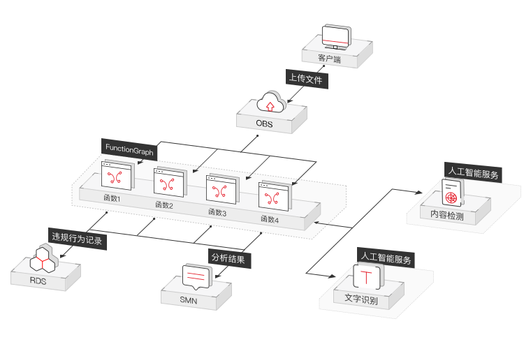

首先要说明的是，虽然华为在 cncf landscape 里写的是 FunctionStage（21年04月），不过官网上注明：

> 原函数服务FunctionStage和原函数工作流FunctionGraph两个服务已合并成一个新的服务，即函数工作流FunctionGraph

FunctionStage 相关页面内容已有段时间没有更新了，下文以 FunctionGraph 来展开说明

[官网地址](https://www.huaweicloud.com/product/functiongraph.html)

# 功能列表

华为 FunctionGraph 提供的功能包括：

* 函数管理
	* 在线代码编辑：Python，Node.js等脚本语言支持用户在线编辑代码，支持语法高亮
	* 上传函数 zip 包
	* 通过 OBS 管理函数 zip 包：在云函数中指定代码所在 Bucket 和 文件对象，平台将自动下载函数代码
* 灵活规格
	* 多语言支持
		* Python
		* Node.js
		* Java
		* Go
	* 多规格支持：提供128M-1.5G等多种规格的函数运行实例
* 弹性伸缩：根据请求扩缩
* 高可用：实例出现问题，系统会自动调度新的函数处理请求
* 事件触发
	* 华为云服务事件触发
	* Http 触发器
	* 时间触发器
* 指标和日志
	* 函数指标监控：提供调用次数，错误次数，拒绝次数，调用时延等关键指标监控
	* 函数的运行日志：记录函数的运行日志，提供灵活的日志查询功能

# 产品更新

华为 FunctionGraph release note：https://support.huaweicloud.com/wtsnew-functiongraph/

截至 2021.04，相关的更新可以归纳为：

| 更新时间 | 更新内容 | 具体 |
|---------|--------|-----|
| 2020.07 | 编程语言支持 | 支持 GO 1.x 新版本 |
| 2020.06 | 新增功能 | 支持预留实例 |
| 2020.05 | 编程语言支持 | 支持 node.js 10 和 node.js 12 |

# 使用场景

| 场景 | 案例描述 |
|-----|--------|
| 实时文件处理 |  |
| 实时数据流处理 |  |
| Web/移动应用后端 |  |
| 人工智能场景 |  |

# 重点功能

## 冷启动

官方文档：

* [预留实例优化冷启动](https://support.huaweicloud.com/usermanual-functiongraph/functiongraph_01_0306.html)
* [Initializer 优化冷启动](https://support.huaweicloud.com/devg-functiongraph/functiongraph_02_0533.html)

华为云针对冷启动的优化，与前面诸平台没太大差异
