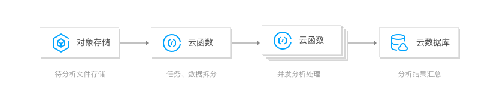

[官网地址](https://cloud.tencent.com/product/scf)

# 功能列表

腾讯 SCF 提供的功能有：

* 代码管理
	* 控制台编辑代码：适用于没有外部依赖的业务代码
	* 上传代码 zip 包
	* 通过 COS 管理 zip 包：在云函数中指定代码所在 Bucket 和 文件对象，平台将自动下载函数代码
* 支持多开发环境
	* Python 2.7 & 3.6
	* Node.js 6.10 & 8.9
	* Java 8
	* Php 5 & 7
* 自动伸缩：根据请求量扩缩容
* 事件触发
	* 腾讯云服务事件
	* Http 触发
	* 时间触发
* 监控和日志

# 产品更新

腾讯 SCF release note：https://cloud.tencent.com/document/product/583/47066

截至 2021.01，相关的更新可以归纳为：

| 更新时间 | 更新内容 | 具体 |
|---------|--------|-----|
| 2021.01.18 | 功能优化 | SCF 异步调用重试能力 |
| 2020.12.29 | 异步执行 | 云函数支持异步执行功能正式发布 |
| 2020.12.29 | 开发者工具 | 云函数 Serverless Web IDE 正式发布 |
| 2020.11.27 | 开发者工具 | 云函数在线调试功能正式发布 |
| 2020.11.17 | 函数集成腾讯云服务 | 云函数支持 CLS 触发器正式发布 |
| 2020.08.06 | 函数集成腾讯云服务 | 基于云函数 SCF 的 Ckafka to Ckafka 转储功能正式发布 |
| 2020.08.05 | 编程语言支持 | 云函数 SCF 定制化运行环境 Custom Runtime 功能正式发布 |
| 2020.07.27 | 预留实例 | 云函数 SCF 预置并发功能内测发布 |
| 2020.07.22 | 函数集成腾讯云服务 | 云函数 SCF 支持 CFS 文件系统正式发布 |

# 使用场景

| 场景 | 案例描述 |
|-----|--------|
| 实时文件处理 |  |
| 数据 ETL 处理 |  |
| 移动及 Web 应用后端 |  |
| AI 推理预测 |  |

# 重点功能

## 冷启动

官方文档：[预置并发](https://cloud.tencent.com/document/product/583/46743)

SCF 针对冷启动的优化，与前面诸平台没太大差异