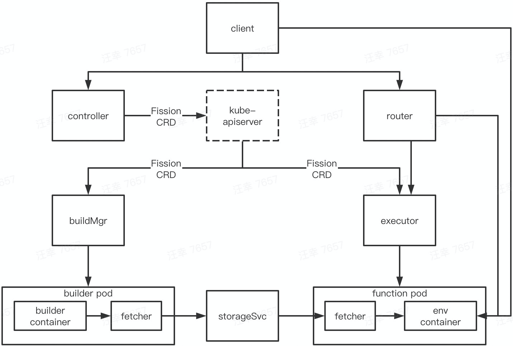

本文基于 [Fission](https://github.com/fission/fission/tree/v1.10.0) v1.10.0 版本

[官方文档](https://docs.fission.io/docs/releases/1.10.0/)

# 最近 release

开始学习之前，先看看本 repo 最近在干什么（截至 2020.10），release note：https://docs.fission.io/docs/releases/

* 1.11.2 [2020.10]
	* Concurrency in PoolManager
	* Autoscaling for MQT integrations with Keda
	* A new lightweight JVM environment
* 1.10.0 [2020.06]
	* S3 as a backend for Storage Service
	* Disabling env variable based discovery in Functions
	* Kube Context flag in Fission CLI
* 1.9.0 [2020.05]
	* Go 1.14 support
	* Function Level timeout
	* External Nats streaming
	* PodSecurityPolicy for Logger
* 1.8.0 [2020.02]
	* Go 1.13 support
	* Dry option to view the generated spec
	* Resource setting for fetcher

大部分是一些功能的补充和增强，值得注意的是，1.11 版本 fission 开始与 Keda 集成

# 部署

结合实战来学习本 repo

## 安装

### 安装 client

```
$ curl -Lo fission https://github.com/fission/fission/releases/download/1.10.0/fission-cli-linux \
    && chmod +x fission && sudo mv fission /usr/local/bin/
```

### 安装 server

```
$ kubectl create ns fission
$ kubectl -n fission apply -f \
    https://github.com/fission/fission/releases/download/1.10.0/fission-core-1.10.0.yaml
```

如果目标 k8s 集群没有相应的 pv provision 机制，还需要：

* 修改 fission-storage-pvc storageClass 为 manual
* 再建个本地 pv 凑活一下

```
# fission-pv.yaml
apiVersion: v1
kind: PersistentVolume
metadata:
  name: fission-storage-pv
  labels:
    type: local
spec:
  storageClassName: manual
  capacity:
    storage: 8Gi
  accessModes:
    - ReadWriteOnce
  hostPath:
    path: "/mnt/fission-storage"
```

确认部署组件都已正常工作

```
$ kubectl -n fission get pod
NAME                           READY   STATUS    RESTARTS   AGE
buildermgr-956dc588-2475q      1/1     Running   0          6m32s
controller-c7b4bc759-5r8c9     1/1     Running   0          6m32s
executor-7489f6b8c-6vcfd       1/1     Running   0          6m32s
kubewatcher-77bd55f9dc-7p44k   1/1     Running   0          6m32s
router-7784db5696-lplqx        1/1     Running   0          6m32s
storagesvc-685c5dd95d-4csdh    1/1     Running   0          6m32s
timer-6565fbbccc-6btrg         1/1     Running   0          6m32s
```
	
### 验证

```
$ fission env create --name nodejs --image fission/node-env:1.10.0
$ curl -LO https://raw.githubusercontent.com/fission/fission/master/examples/nodejs/hello.js
$ fission fn create --name hello-js --env nodejs --code hello.js
$ fission fn test --name hello-js
hello, world!
```

## 卸载

```
$ kubectl -n fission delete -f \
    https://github.com/fission/fission/releases/download/1.10.0/fission-core-1.10.0.yaml
$ kubectl delete ns fission
$ kubectl delete pv fission-storage-pv
```

# 架构

安装完 Fission 之后，来梳理下安装的组件

| pod | 容器 | 命令 | 源码 repo |
|----|----|-----|--------|
| buildermgr | buildermgr | fission-bundle --builderMgr ... | Fission |
| controller | controller | fission-bundle --controllerPort ... | Fission |
| executor | executor | fission-bundle --executorPort ... | Fission |
| router | router | fission-bundle --routerPort ... | Fission |
| storagesvc | storagesvc | fission-bundle --storageServicePort ... | Fission |

注：

* kubewatcher 和 timer 虽然缺省安装了，但不是 core 组件，暂不说明
* 除此之外，函数生成的 pod 还自带一个 fetcher 容器，该容器也是 Fission repo 编译而来

整体架构是：



其中：

* fission client 封装了网络调用
* controller 处理函数相关对象的 crud，并转化为 k8s 里的 CRD 操作
* router 负责处理函数的寻址、触发
* buildermgr 处理函数编译相关工作
* executor 负责函数实例化管理
* storageSvc 负责存储函数代码的编译包

直接对着架构图解读，比较抽象，在使用小节会结合实例来详细说明

# 概念

Fission 引入了 environment、package、function、trigger 四类 CRD。其中：

* environment 记录了函数运行环境、编译环境相关的信息
* package 记录了函数源码、编译包相关的信息
* function 记录了函数运行相关的信息
* trigger 记录了函数触发相关的信息

在使用小节会结合实例来详细说明

# 使用

## 基本功能

本小节会按照“从零开始写一个 go 函数”的流程，来串联所有组件，梳理功能

### 创建 go 环境

```
$ fission env create --name go --image fission/go-env-1.12:1.10.0 --builder fission/go-builder-1.12:1.10.0
```

上述命令创建了 go 环境，指定了后续编译、运行的镜像信息。涉及的完整流程是：

* fission client 向 controller 发起了创建 env 的请求
* controller 收到请求后，创建了 environment CR

	```
	$ kubectl get environment
	NAME     AGE
	go       5m15s
	```
* buildermgr watch 到 environment CR 后，创建了 builder pod

	```
	$ kubectl -n fission-builder get pod
	NAME                          READY   STATUS    RESTARTS   AGE
	go-2598787-6d879c4b9f-n5654   2/2     Running   0          7m
	```	
* executor watch 到 environment CR 后，创建了 pod pool

	```
	$ kubectl -n fission-function get pod
	NAME                                              READY   STATUS        RESTARTS   AGE
	poolmgr-go-default-2598787-56b88b84d7-cv9b7       2/2     Running       0          18m
	```

注：

* executor 有两种 pod 管理模式，[PoolMgr](https://docs.fission.io/docs/usage/executor/#poolmgr-pool-based-executor)（pod 资源池） 和 [NewDeploy](https://docs.fission.io/docs/usage/executor/#newdeploy-new-deployment-executor)（每次新建 pod）。缺省是 pool，本流程解读都会以 pool 来说明
	
### 编写 go 代码

```
$ cat hello.go
package main

import (
	"net/http"
)

func Hello(w http.ResponseWriter, r *http.Request) {
	msg := "hello, world!\n"
	w.Write([]byte(msg))
}
```

fission go 代码的编写比较常规，没什么特殊要求，接口参数保持规范即可

### 创建函数

```
$ fission fn create --name hello-go --env go --src hello.go --entrypoint Hello
```

上述命令指定 go env 以上述代码创建了 fission 函数。涉及的完整流程是：

* fission client 向 controller 发起了创建 fn 的请求
* controller 收到请求后，创建了 function CR 和 package CR

	```
	# 用全名是因为跟 Kubeless function 重名，同时安装时，让命令无二意性
	$ kubectl get function.fission.io
	NAME       AGE
	hello-go   5m
	$ kubectl get package
	NAME                                             AGE
	hello-go-b69975a4-913b-45e7-928b-de40c23332b3    5m18s
	```
	其中，package 里存储了 hello.go 的源码
* buildmgr watch 到 package CR 后，向上面创建的 builder pod 发起编译请求
* builder container 从 package 里获取源码，开始编译
* builder container 编译完成后，通知 fetcher container 将编译包上传至 storagesvc

	```
	# 实际上最终也就上传到了我们前面创建 pv 所指定的目录
	$ du -sh /mnt/fission-storage/fission-functions/*
	4.7M	/mnt/fission-storage/fission-functions/f8903b8b-5a34-4fc7-8f4a-ed93bc61ea95
	```
* builder container 将编译日志和编译包的 url 等信息都存储于 package 中

	```
	# 可以查看编译过程具体干了些啥
	$ kubectl get package hello-go-b69975a4-913b-45e7-928b-de40c23332b3 -o yaml
	...
	+ go build -buildmode=plugin -i -o /packages/hello-go-b69975a4-913b-45e7-928b-de40c23332b3-kz1zbh-xmguf3 .
	...
	```
	
### 触发函数

```
$ fission fn test --name hello-go
hello, world!
```

上述命令测试了刚刚创建的函数。涉及的完整流程是：

* fission client 向 router 发起了触发 fn 的请求
* router 收到请求后，请求 executor 提供函数地址
* executor 从 pool 中选出一个 ready 的 pod，通知 pod 里的 fetch 容器
* fetch 容器从 storagesvc 中获取编译包，取完通知 env 容器
* env 容器加载函数，加载完成返回函数地址给 router
* router 返回函数地址到 fission client
* fission client 发起函数调用请求

## 函数扩缩

在 PoolMgr 模式下，同一个函数最多实例化 pool size 个 pod，长时间没有访问时，pod 会销毁，除此之外，并没有其它的扩缩容能力。Fission 的自动扩缩，主要是针对 NewDeploy 模式

```
$ fission fn create --name hello-go-deploy --env go --src hello.go --entrypoint Hello --executortype newdeploy \
	--minscale 0 --maxscale 3 --targetcpu 50
```

当上述函数第一次被触发时，会创建一个 HPA，实际的伸缩能力也是由 HPA 提供的。不过，HPA 并不具备缩容到0的能力，"scale up from zero" 和 "scale down to zero" 的能力是 executor 补足的

## 冷启动

Fission、Kubeless、OpenFaas 3个 faas 实现里，Fission 是唯一一个有冷启动优化的，也就是 PoolMgr 模式，省去了镜像拉取、容器启动的时间。而 Kubeless 直接没有提及，OpenFaas 只有最佳实践的建议，也就是不要配置扩缩容时，最小副本数低于1

## 函数触发

上述小节以命令行的形式，手工触发函数调用，而在生产环境，Fission 提供了以下几种触发方式：

* http trigger

	```
	$ fission httptrigger create --name hello --url /hello --method GET --function hello-go
	trigger 'hello' created
	# 通过以下地址触发
	http://<router URL>:<port>/hello
	```
* message queue trigger

	Fission 支持多种 message queue，包括：NATS、Kafka、KEDA，不过因为需要额外安装组件，这里就不再演示了
* timer trigger

	```
	$ fission timer create --name minute --function hello-go --cron "*/1 * * * *"
	trigger 'minute' created
	Current Server Time: 	2020-08-19T12:59:43Z
	Next 1 invocation: 	2020-08-19T13:00:43Z
	```

## workflow

[fission-workflows](https://github.com/fission/fission-workflows/tree/0.6.0) 是用于编排函数执行顺序的子项目，[参考文档](https://docs.fission.io/docs/workflows/)

不过，这个项目应该是凉了，最新的 release 0.6.0 是18年发布的，安装、使用各种问题：

* 如安装时，helm 里使用的 jaegertracing/jaeger-agent 是 latest 镜像，跟启动参数已经不兼容了，可以手工替换成 1.8.2 版本
* 如使用时，参考文档案例跑不通，相关的 [issue](https://github.com/fission/fission-workflows/issues/250) 无人处理
