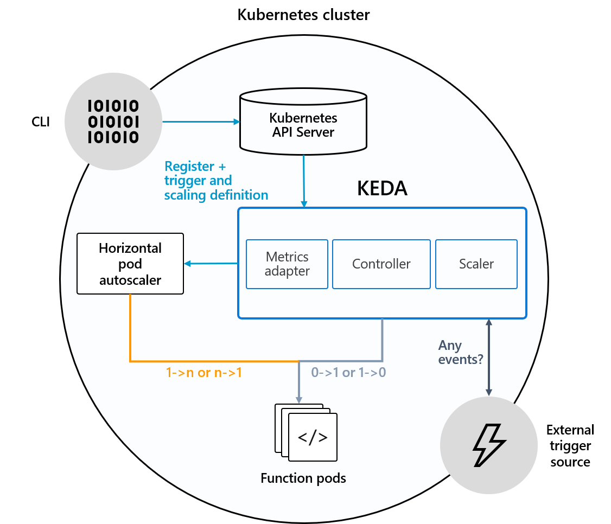

本文基于 [KEDA](https://github.com/kedacore/keda/tree/v1.5.0) v1.5.0 版本

[官方文档](https://keda.sh/docs/1.5/)

# 最近 release

开始学习之前，先看看本 repo 最近在干什么（截至 2020.12）：

* 2.0.0 [2020.11]
	* Introduce Azure Log Analytics scaler
	* Introduce scaling any CustomResource that implements Scale subresource
	* Provide KEDA go-client
	* Provide KEDA readiness and liveness probes
* 1.5.0 [2020.07]
	* Introduce Active MQ Artemis scaler
	* Introduce Redis Streams scaler
	* Introduce Cron scaler
* 1.4.0 [2020.04]
	* Fix scalers leaking
	* Extend RabbitMQ scaler to support count unacked messages
	* Handle nil pointers and empty arrays properly in Azure Monitor Scaler

KEDA 功能较为简单，目前的更新主要是丰富 scaler 和代码优化、修复

# 部署

结合实战来学习本 repo

## 安装

```
$ curl -Lo keda-1.5.0.tar.gz https://github.com/kedacore/keda/releases/download/v1.5.0/keda-1.5.0.tar.gz \
	&& tar -xf keda-1.5.0.tar.gz
$ kubectl apply -f keda-1.5.0/crds/ && kubectl apply -f keda-1.5.0
```

确认部署组件都已正常工作

```
$ kubectl -n keda get pod
NAME                                      READY   STATUS    RESTARTS   AGE
keda-metrics-apiserver-5f559d77d5-kbjdq   1/1     Running   0          6m22s
keda-operator-86dfcdf979-n568j            1/1     Running   0          6m22s
```

## 卸载

```
$ kubectl delete -f keda-1.5.0/crds/ && kubectl delete -f keda-1.5.0
```

# 架构

安装完 KEDA 之后，来梳理下安装的组件

| pod | 容器 | 命令 | 源码 repo |
|----|----|-----|--------|
| keda-metrics-apiserver | keda-metrics-apiserver | keda-adapter --secure-port=6443 ... | KEDA |
| keda-operator | keda-operator | keda --zap-level=info ... | KEDA |

operator 补足了 HPA 的能力，提供了缩容到0和从0扩容的能力；而 metrics-apiserver 则是作为 [kubernetes metrics server](https://kubernetes.io/docs/tasks/run-application/horizontal-pod-autoscale/#support-for-custom-metrics)，配合 HPA 工作



[图片来源](https://keda.sh/docs/1.5/concepts/#architecture)

上图中 KEDA 有3个逻辑组件：Metrics adapter（metrics-apiserver）、Controller（operator）和 Scaler。Scaler 代表 KEAD 能用于扩缩的事件源，分为内置和外置两部分

内置事件源包括但不限于：

* [Apache Kafka](https://keda.sh/docs/1.5/scalers/apache-kafka/)
* [AWS CloudWatch](https://keda.sh/docs/1.5/scalers/aws-cloudwatch/)
* [Azure Blob Storage](https://keda.sh/docs/1.5/scalers/azure-storage-blob/)
* [Cron](https://keda.sh/docs/1.5/scalers/cron/)
* [Huawei Cloudeye](https://keda.sh/docs/1.5/scalers/huawei-cloudeye/)
* ...

外部事件源需要按照一定的接口规范实现：[External Scalers](https://keda.sh/docs/1.5/concepts/external-scalers/)

# 概念

KEDA 引入了 scaledobject、scaledjob 和 triggerauthentication 三类 CRD

* scaledobject 记录了事件源和 Deployment、StatefulSet 或者任何实现了 /scale Custom Resource 的映射
* scaledjob 记录了事件源和 Job 的映射
* triggerauthentication 记录了访问事件源所需的鉴权数据

# 使用

这里以 rabbitmq 作为 scaler，来演示 KEDA 的工作流程

## 安装 rabbitmq

如果测试的集群，没有动态 pv 供应的能力，这里可以先手工创建一个：

```
$ cat rabbit-pv.yaml
apiVersion: v1
kind: PersistentVolume
metadata:
  name: rabbit-data-pv
  labels:
    type: local
spec:
  capacity:
    storage: 8Gi
  accessModes:
    - ReadWriteOnce
  hostPath:
    path: "/mnt/rabbit-data"
$ kubectl apply -f rabbit-pv.yaml
```

使用 helm 安装 rabbitmq

```
$ helm repo add bitnami https://charts.bitnami.com/bitnami
$ helm install rabbitmq --set auth.username=user --set auth.password=PASSWORD --set volumePermissions.enabled=true bitnami/rabbitmq
```

## 创建扩缩容对象

获取扩缩容对象 yaml

```
$ curl -Lo consumer.yaml https://raw.githubusercontent.com/kedacore/sample-go-rabbitmq/v1/deploy/deploy-consumer.yaml
```

扩缩容对象是一个通俗化的称呼，它包括：

* deployment：最终扩缩容的对象
* scaledobject：指明了扩缩容对象及其依赖的指标信息，以及一些可选的常规配置，如 cooldownPeriod（多久没有事件开始缩容）

	```
	spec:
	  scaleTargetRef:
	    deploymentName: rabbitmq-consumer
	  pollingInterval: 5
	  cooldownPeriod: 30
	  maxReplicaCount: 30
	  triggers:
	    - type: rabbitmq
	      metadata:
	        queueName: hello
	        queueLength: "5"
	```
* [optional] triggerauthentication：这里是访问 rabbitmq 所需的用户名、密码

创建扩缩容对象

```
$ kubectl apply -f consumer.yaml
```

上述命令涉及的完整流程是：

* 用户创建了 scaledobject
* operator 创建对应的 hpa

	```
	$ kubectl get hpa
	NAME                         REFERENCE                      TARGETS             MINPODS   MAXPODS   REPLICAS   AGE
	keda-hpa-rabbitmq-consumer   Deployment/rabbitmq-consumer   <unknown>/5 (avg)   1         30        0          37s
	```
* 此时没有事件，operator 将 deployment 缩容到0

	```
	$ kubectl get deploy
	NAME                READY   UP-TO-DATE   AVAILABLE   AGE
	rabbitmq-consumer   0/0     0            0           2m45s
	```
	
## 发布事件

```
$ curl -Lo publisher.yaml https://raw.githubusercontent.com/kedacore/sample-go-rabbitmq/v1/deploy/deploy-publisher-job.yaml
$ kubectl apply -f publisher.yaml
```

事件发布之后，后台发生的事情：

* operator 在收到事件后，会完成 deployment 从0->1的操作

	```
	$ kubectl -n keda logs -f keda-operator-86dfcdf979-ld9p5
	...
	{"level":"info","ts":1604311191.196108,"logger":"scalehandler","msg":"Successfully updated deployment","ScaledObject.Namespace":"default","ScaledObject.Name":"rabbitmq-consumer","ScaledObject.ScaleType":"deployment","Deployment.Namespace":"default","Deployment.Name":"rabbitmq-consumer","Original Replicas Count":0,"New Replicas Count":1}
	...
	```
* operator 持续查询 metrics-apiserver

	```
	$ kubectl -n keda logs keda-metrics-apiserver-5f48d866b9-r6ntm | grep "Keda provider received request" | head -3
	I1102 09:26:03.374506       1 provider.go:59] keda_metrics_adapter/provider "msg"="Keda provider received request for external metrics"  "metric name"="queuelength" "metricSelector"="deploymentName=rabbitmq-consumer" "namespace"="default"
	I1102 09:26:18.436944       1 provider.go:59] keda_metrics_adapter/provider "msg"="Keda provider received request for external metrics"  "metric name"="queuelength" "metricSelector"="deploymentName=rabbitmq-consumer" "namespace"="default"
	I1102 09:26:34.140904       1 provider.go:59] keda_metrics_adapter/provider "msg"="Keda provider received request for external metrics"  "metric name"="queuelength" "metricSelector"="deploymentName=rabbitmq-consumer" "namespace"="default"
	```
* operator 更新 hpa

	```
	$ kubectl get hpa -o yaml | grep current-me
	      autoscaling.alpha.kubernetes.io/current-metrics: '[{"type":"External","external":{"metricName":"queueLength","metricSelector":{"matchLabels":{"deploymentName":"rabbitmq-consumer"}},"currentValue":"0","currentAverageValue":"292"}}]'
	```
* hpa 最终完成 deploy 的扩缩

	```
	$ kubectl get deploy
	NAME                READY   UP-TO-DATE   AVAILABLE   AGE
	rabbitmq-consumer   12/30   30           12          12m
	```

## 小结

以上演示的是 scaledobject，scaledjob 相比于前者，主要就是用来处理长时运行的函数。原文：

> As an alternate to scaling event-driven code as deployments you can also run and scale your code as Kubernetes Jobs. The primary reason to consider this option is to handle processing long running executions. Rather than processing multiple events within a deployment, for each detected event a single Kubernetes Job is scheduled. That job will initialize, pull a single event from the message source, and process to completion and terminate.

除此之外，并无太大差别

