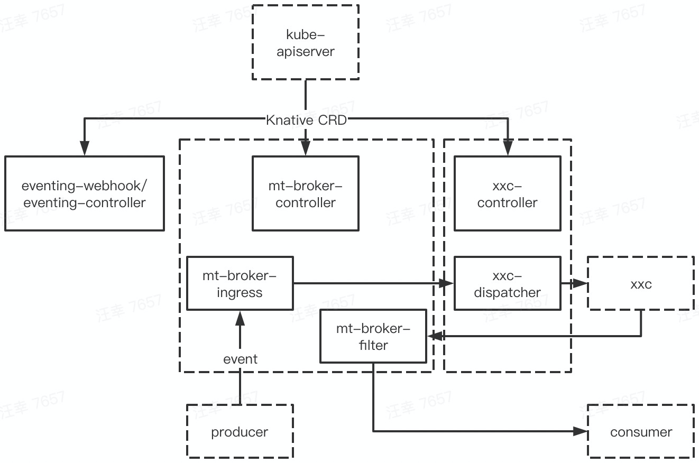

本文基于 Knative [serving](https://github.com/knative/serving/tree/v0.17.0)，[eventing](https://github.com/knative/eventing/tree/v0.17.0) v0.17.0 版本

[官方文档](https://knative.dev/docs/)

# 最近 release

开始学习之前，先看看本 repo 最近在干什么

## serving

* [0.17.0](https://github.com/knative/serving/releases/tag/v0.17.0) [2020.08]
	* Meta
		* initialScale annotation to control the initial deployment size
		* net-contour and net-kourier have moved to Beta
	* Autoscaling
		* Launched new KPA statuses, which permit significant simplification of the state machine in revision and KPA itself
		* Concurrency & stat reporting rewrite in Activator
	* Core API
		* Leader Election enabled by default
		* Adopt a two-lane work queue for our controllers to prevent starvation during global re-syncs pkg
	* Networking
		* Code in knative/serving/pkg/network is completely moved to knative/networking repo
		* Kingress (net-istio) introduces RewriteHost feature
* [0.16.0](https://github.com/knative/serving/releases/tag/v0.16.0) [2020.07]
* [0.15.0](https://github.com/knative/serving/releases/tag/v0.15.0) [2020.05]

## eventing

* [0.17.0](https://github.com/knative/eventing/releases/tag/v0.17.0) [2020.08]
	* ContainerSource、SinkBinding is now in v1beta1
	* Eventing conformance tests now can validate Sources status conformance
	* PingSource now supports setting the time zone
* [0.16.0](https://github.com/knative/eventing/releases/tag/v0.16.0) [2020.07]
* [0.15.0](https://github.com/knative/eventing/releases/tag/v0.15.0) [2020.05]

serving、eventing 实际更新的内容很多，项目在很活跃的发展，全量更新可以自行点击链接确认

# 部署

结合实战来学习本 repo

注：knative 0.17 需要 k8s 1.16+

## 安装 client

```
$ curl https://github.com/knative/client/releases/download/v0.16.0/kn-linux-amd64 -o kn \
    && chmod +x kn && sudo mv kn /usr/local/bin/
```

## 安装 istio

安装 knative 需要选择安装一个网络层，可选的包括 Ambassador、Contour、Gloo、Istio、Kong、Kourier，这里选择 istio

### 安装 istio client

```
$ curl -L https://github.com/istio/istio/releases/download/1.6.8/istio-1.6.8-linux-amd64.tar.gz -o istio-1.6.8.tar \
    && tar -xf istio-1.6.8.tar && sudo mv istio-1.6.8/bin/istioctl /usr/local/bin/
```

### 安装 istio server

本篇不是对 istio 做介绍，这里就选用最简单的方式，通过 istio operator 来安装 istio server

```
$ cat istio-minimal-operator.yaml
apiVersion: install.istio.io/v1alpha1
kind: IstioOperator
spec:
  values:
    global:
      proxy:
        autoInject: disabled
      useMCP: false
      jwtPolicy: first-party-jwt

  addonComponents:
    pilot:
      enabled: true
    prometheus:
      enabled: false

  components:
    ingressGateways:
    - name: istio-ingressgateway
      enabled: true
    - name: cluster-local-gateway
      enabled: true
      label:
        istio: cluster-local-gateway
        app: cluster-local-gateway
      k8s:
        service:
          type: ClusterIP
          ports:
          - port: 15020
            name: status-port
          - port: 80
            name: http2
          - port: 443
            name: https
$ istioctl manifest apply -f istio-minimal-operator.yaml
```

确认部署组件都已正常工作

```
$ kubectl -n istio-system get pod
NAME                                     READY   STATUS    RESTARTS   AGE
cluster-local-gateway-647598f7cd-rrsvw   1/1     Running   0          41h
istio-ingressgateway-75d5967d8c-pr2t5    1/1     Running   0          41h
istiod-95c865c7b-c9cmv                   1/1     Running   0          41h
```

## 安装 serving

### 安装

```
$ kubectl apply -f https://github.com/knative/serving/releases/download/v0.17.0/serving-crds.yaml
$ kubectl apply -f https://github.com/knative/serving/releases/download/v0.17.0/serving-core.yaml
$ kubectl apply -f https://github.com/knative/net-istio/releases/download/v0.17.0/release.yaml
```

如果目标 k8s 集群有 loadBalancer service 的处理能力，那么可以参考[官方文档](https://knative.dev/docs/install/any-kubernetes-cluster/#installing-the-serving-component)做一下 dns 配置。如果没有的话，可以先用一些比较简陋的方法，绕过这些配置，跑完完整流程

```
$ export INTERNAL_INGRESS_HOST=$(kubectl -n istio-system get svc cluster-local-gateway -o jsonpath='{.spec.clusterIP}')
```

确认部署组件都已正常工作

```
$ kubectl -n knative-serving get pod
NAME                                READY   STATUS    RESTARTS   AGE
activator-68cbc9b5c7-c5t92          1/1     Running   0          42h
autoscaler-5cf649dbb-w8gsn          1/1     Running   0          42h
controller-bc8d75cbc-4b58w          1/1     Running   0          42h
istio-webhook-6dd89ff45d-cr56j      1/1     Running   0          40h
networking-istio-5d68bb7d56-qrlfh   1/1     Running   0          40h
webhook-85758f4589-mckkp            1/1     Running   0          42h
```

### 验证

```
$ kn service create hello-serving --image gcr.io/knative-samples/helloworld-go@sha256:5ea96ba4b872685ff4ddb5cd8d1a97ec18c18fae79ee8df0d29f446c5efe5f50
Creating service 'hello-serving' in namespace 'default':

  0.011s The Configuration is still working to reflect the latest desired specification.
  0.043s The Route is still working to reflect the latest desired specification.
  0.057s Configuration "hello-serving" is waiting for a Revision to become ready.
 10.940s ...
 10.999s Ingress has not yet been reconciled.
 11.055s ...
 11.077s Waiting for load balancer to be ready
 11.279s Ready to serve.

Service 'hello-serving' created to latest revision 'hello-serving-fbksc-1' is available at URL:
http://hello-serving.default.example.com
# 如果上面有配置过 dns，则直接用普通的 curl 就可以了
$ curl -H "Host: hello-serving.default.example.com" http://$INTERNAL_INGRESS_HOST
Hello World!
```

## 安装 eventing

### 安装

```
$ kubectl apply -f https://github.com/knative/eventing/releases/download/v0.17.0/eventing-crds.yaml
$ kubectl apply -f https://github.com/knative/eventing/releases/download/v0.17.0/eventing-core.yaml
$ kubectl apply -f https://github.com/knative/eventing/releases/download/v0.17.0/in-memory-channel.yaml
$ kubectl apply -f https://github.com/knative/eventing/releases/download/v0.17.0/mt-channel-broker.yaml
```

确认部署组件都已正常工作

```
$ kubectl -n knative-eventing get pod
NAME                                   READY   STATUS    RESTARTS   AGE
eventing-controller-7558c947d-jgmpt    1/1     Running   0          20h
eventing-webhook-847f56845b-67j8v      1/1     Running   0          20h
imc-controller-7c95488bb5-sqmvm        1/1     Running   0          19h
imc-dispatcher-7fdfff678-rcf2g         1/1     Running   0          19h
mt-broker-controller-b5f997765-cwzwx   1/1     Running   0          19h
mt-broker-filter-657cbfbcf6-7pzkj      1/1     Running   0          19h
mt-broker-ingress-6b5598b45d-pbzf7     1/1     Running   0          19h
```

### 验证

验证用的4个 yaml 文件：

```
$ cat broker.yaml
apiVersion: eventing.knative.dev/v1
kind: broker
metadata:
  name: default
  namespace: hello-eventing

$ cat consumer.yaml
apiVersion: apps/v1
kind: Deployment
metadata:
  name: hello-display
  namespace: hello-eventing
spec:
  replicas: 1
  selector:
    matchLabels: &labels
      app: hello-display
  template:
    metadata:
      labels: *labels
    spec:
      containers:
      - name: event-display
        image: gcr.io/knative-releases/knative.dev/eventing-contrib/cmd/event_display@sha256:49dac8ea142b5d00bbb4b12f6a9cacb2b7826f36037e2d34d304cdcd289233c3
---
kind: Service
apiVersion: v1
metadata:
  name: hello-display
  namespace: hello-eventing
spec:
  selector:
    app: hello-display
  ports:
  - protocol: TCP
    port: 80
    targetPort: 8080

$ cat trigger.yaml
apiVersion: eventing.knative.dev/v1
kind: Trigger
metadata:
  name: hello-display
  namespace: hello-eventing
spec:
  broker: default
  filter:
    attributes:
      type: greeting
  subscriber:
    ref:
     apiVersion: v1
     kind: Service
     name: hello-display

$ cat producer.yaml
apiVersion: v1
kind: Pod
metadata:
  labels:
    run: curl
  name: curl
  namespace: hello-eventing
spec:
  containers:
    # This could be any image that we can SSH into and has curl.
  - image: radial/busyboxplus:curl
    imagePullPolicy: IfNotPresent
    name: curl
    resources: {}
    stdin: true
    terminationMessagePath: /dev/termination-log
    terminationMessagePolicy: File
    tty: true
```

```
$ kubectl create ns hello-eventing
$ kubectl apply -f broker.yaml -f consumer.yaml -f trigger.yaml -f producer.yaml
$ kubectl -n hello-eventing attach curl -it
[ root@curl:/ ]$ curl "http://broker-ingress.knative-eventing.svc.cluster.local/hello-eventing/default" -X POST -H "Ce-Id: say-hello" -H "Ce-Specversion: 1.0" -H "Ce-Type: greeting" -H "Ce-Source: not-sendoff" -d {"msg":"hello, world!"}
[ root@curl:/ ]$ exit
$ kubectl -n hello-eventing logs -l app=hello-display --tail=2
Data,
  {msg:hello, world!}
```

# 架构

安装完 Knative 之后，来梳理下安装的组件

| namespace | pod |命令 | 源码 repo |
|----------|----|----|--------|
| knative-serving | istio-webhook | webhook | [net-istio](https://github.com/knative-sandbox/net-istio/tree/v0.17.0) |
| | networking-istio | controller | net-istio |
| | webhook | webhook | serving |
| | controller | controller | serving |
| | activator | activator | serving |
| | autoscaler | autoscaler | serving |
| knative-eventing | eventing-webhook | webhook | eventing |
| | eventing-controller | controller | eventing |
| | imc-controller | channel_controller | eventing |
| | imc-dispatcher | channel_dispatcher | eventing |
| | mt-broker-controller | mtchannel_broker | eventing |
| | mt-broker-filter | filter | eventing |
| | mt-broker-ingress | ingress | eventing |
| istio-system | istiod | pilot-discovery | [istio](https://github.com/istio/istio/tree/1.6.8) |
| | istio-ingressgateway | pilot-agent | istio |
| | cluster-local-gateway | pilot-agent | istio |

注：

* istiod、istio-ingressgateway 和 cluster-local-gateway 是 istio 相关组件，暂不过多说明
* 很多二进制都叫 webhook、controller，但他们并无联系，只不过都是通用的 webhook/controller 模型
* 除了上述组件之外，serving 还会给用户 pod 插入一个 queue-proxy 的容器

serving 整体架构是：


其中：

* kn client 封装了网络调用
* webhook/controller 负责 serving 内部各种 CRD 的初始化、校验和流程管理
* istio-webhook/networking-istio 负责 Knative-istio 间 CRD 的转换，以调用 istio 的能力
* 当副本为0时，ingress gateway 会将请求转发至 activator，触发 pod 0->1 的扩容
* queue-proxy 会采集容器 metrics，并上报给 autoscaler
* autoscaler 处理扩缩相关逻辑，包括根据 metrics，完成 pod 动态扩缩

eventing 整体架构是：



其中：

* webhook、controller 相关组件基本工作于控制面
	* eventing-webhook/eventing-controller 负责 eventing 大部分 CRD 的处理
	* mt-broker-controller(mt: multi tenant) 负责 broker 相关的逻辑
	* xxc-controller 负责对应 channel 相关逻辑，缺省安装的是 imc(imc: in memory channel)
* 其它组件工作于数据面
	* mt-broker-ingress 是 broker 的入口，mt-broker-filter 负责按用户配置做分发过滤
	* xxc-dispatcher 负责 event 的接收、转发，而 xxc 则是对应的 channel provider，如 kafka。imc 比较特殊，相应功能直接在 dispatcher 里实现的

在使用小节会结合实例来详细说明
