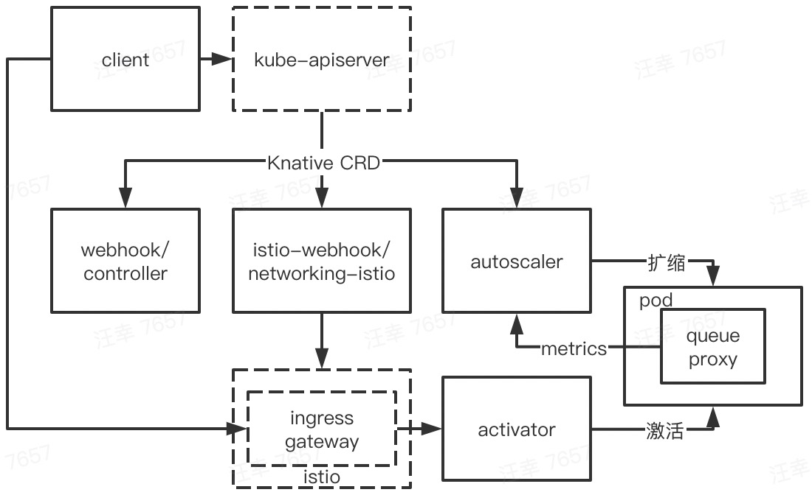

安装完 Knative 之后，来梳理下安装的组件

| namespace | pod |命令 | 源码 repo |
|----------|----|----|--------|
| knative-serving | istio-webhook | webhook | [net-istio](https://github.com/knative-sandbox/net-istio/tree/v0.17.0) |
| | networking-istio | controller | net-istio |
| | webhook | webhook | serving |
| | controller | controller | serving |
| | activator | activator | serving |
| | autoscaler | autoscaler | serving |
| knative-eventing | eventing-webhook | webhook | eventing |
| | eventing-controller | controller | eventing |
| | imc-controller | channel_controller | eventing |
| | imc-dispatcher | channel_dispatcher | eventing |
| | mt-broker-controller | mtchannel_broker | eventing |
| | mt-broker-filter | filter | eventing |
| | mt-broker-ingress | ingress | eventing |
| istio-system | istiod | pilot-discovery | [istio](https://github.com/istio/istio/tree/1.6.8) |
| | istio-ingressgateway | pilot-agent | istio |
| | cluster-local-gateway | pilot-agent | istio |

注：

* istiod、istio-ingressgateway 和 cluster-local-gateway 是 istio 相关组件，暂不过多说明
* 很多二进制都叫 webhook、controller，但他们并无联系，只不过都是通用的 webhook/controller 模型
* 除了上述组件之外，serving 还会给用户 pod 插入一个 queue-proxy 的容器

# serving

serving 整体架构是：

其中：

* kn client 封装了网络调用
* webhook/controller 负责 serving 内部各种 CRD 的初始化、校验和流程管理
* istio-webhook/networking-istio 负责 Knative-istio 间 CRD 的转换，以调用 istio 的能力
* 当副本为0时，ingress gateway 会将请求转发至 activator，触发 pod 0->1 的扩容
* queue-proxy 会采集容器 metrics，并上报给 autoscaler
* autoscaler 处理扩缩相关逻辑，包括根据 metrics，完成 pod 动态扩缩

# eventing

eventing 整体架构是：

其中：

* webhook、controller 相关组件基本工作于控制面
	* eventing-webhook/eventing-controller 负责 eventing 大部分 CRD 的处理
	* mt-broker-controller(mt: multi tenant) 负责 broker 相关的逻辑
	* xxc-controller 负责对应 channel 相关逻辑，缺省安装的是 imc(imc: in memory channel)
* 其它组件工作于数据面
	* mt-broker-ingress 是 broker 的入口，mt-broker-filter 负责按用户配置做分发过滤
	* xxc-dispatcher 负责 event 的接收、转发，而 xxc 则是对应的 channel provider，如 kafka。imc 比较特殊，相应功能直接在 dispatcher 里实现的

在使用小节会结合实例来详细说明
