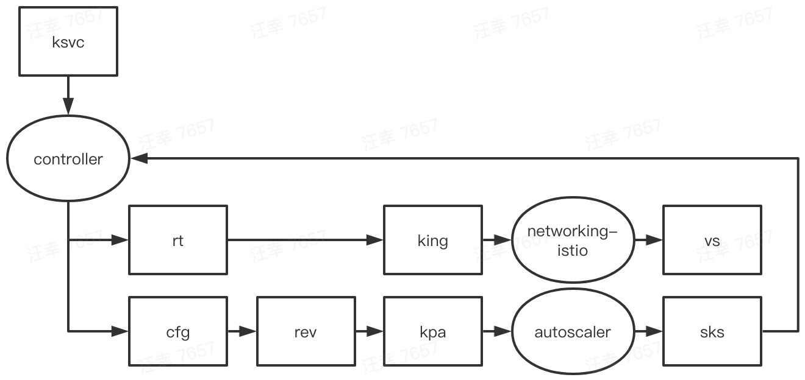

# 基本功能-serving

本小节会按照“从零开始写一个 go 应用”的流程，来梳理功能

## 编写 go 代码

```
$ cat hello.go
package main

import (
	"fmt"
	"log"
	"net/http"
)

func handler(w http.ResponseWriter, r *http.Request) {
	fmt.Fprintf(w, "hello, world!\n")
}

func main() {
	http.HandleFunc("/", handler)
	port := "8080"
	log.Fatal(http.ListenAndServe(fmt.Sprintf(":%s", port), nil))
}
```

在 serving 体系下编写 go 应用，跟常规 go web 开发并无区别

## 构造镜像

```
$ cat Dockerfile
FROM golang:1.13 as builder
WORKDIR /app
COPY . ./
RUN CGO_ENABLED=0 GOOS=linux go build -v -o server

FROM alpine:3
RUN apk add --no-cache ca-certificates
COPY --from=builder /app/server /server
CMD ["/server"]

$ docker build . -t dev.local/hello-go:serving
```

常规编译，没什么要补充的

## 部署应用

```
$ cat service.yaml
apiVersion: serving.knative.dev/v1
kind: Service
metadata:
  name: hello-go
spec:
  template:
    spec:
      containers:
      - image: dev.local/hello-go:serving

$ kubectl apply -f service.yaml
```

创建 ksvc 涉及的完整流程是：

* 创建了 ksvc

	```
	kubectl get ksvc
	NAME       URL                                   LATESTCREATED    LATESTREADY      READY   REASON
	hello-go   http://hello-go.default.example.com   hello-go-6wdlw   hello-go-6wdlw   True
	```
* controller 依据 ksvc 创建了对应的 rt、cfg

	```
	$ kubectl get rt
	NAME       URL                                   READY   REASON
	hello-go   http://hello-go.default.example.com   True
	$ kubectl get cfg
	NAME       LATESTCREATED    LATESTREADY      READY   REASON
	hello-go   hello-go-6wdlw   hello-go-6wdlw   True
	```
* controller 依据 cfg 创建了对应的 rev

	```
	$ kubectl get rev
	NAME             CONFIG NAME   K8S SERVICE NAME   GENERATION   READY   REASON
	hello-go-6wdlw   hello-go      hello-go-6wdlw     1            True
	```
* controller 依据 rt 创建了 king

	```
	$ kubectl get king
	NAME       READY   REASON
	hello-go   True
	```
* networking-istio 依据 king 创建了 VirtualService(vs)，后者是 istio CRD，接下来就是 istio 的逻辑了，这里就不再展开 

	```
	$ kubectl get vs
	NAME               GATEWAYS                                                                          HOSTS                                                                                                     AGE
	hello-go-ingress   [knative-serving/cluster-local-gateway knative-serving/knative-ingress-gateway]   [hello-go.default hello-go.default.example.com hello-go.default.svc hello-go.default.svc.cluster.local]   2d20h
	hello-go-mesh      [mesh]                                                                            [hello-go.default hello-go.default.svc hello-go.default.svc.cluster.local]                                2d20h
	```
* controller 依据 rev 创建了 kpa

	```
	$ kubectl get kpa
	NAME             DESIREDSCALE   ACTUALSCALE   READY   REASON
	hello-go-6wdlw   0              0             False   NoTraffic
	```
* autoscaler 依据 kpa 创建了 sks

	```
	$ kubectl get sks
	NAME             MODE    ACTIVATORS   SERVICENAME      PRIVATESERVICENAME       READY     REASON
	hello-go-6wdlw   Proxy   2            hello-go-6wdlw   hello-go-6wdlw-private   Unknown   NoHealthyBackends
	```
* controller 依据  rev 创建了 deploy
* svc 的创建要稍微麻烦一些，实际上创建了3个 service

	```
	$ kubectl get svc
	NAME                     TYPE           CLUSTER-IP       EXTERNAL-IP                                            PORT(S)                             AGE
	hello-go                 ExternalName   <none>           cluster-local-gateway.istio-system.svc.cluster.local   <none>                              2d21h
	hello-go-6wdlw           ClusterIP      10.96.213.237    <none>                                                 80/TCP                              2d21h
	hello-go-6wdlw-private   ClusterIP      10.108.110.187   <none>                                                 80/TCP,9090/TCP,9091/TCP,8022/TCP   2d21h
	```
	我们的用例只用到了其中一个，其它的如 hello-go，是用于外部域名到内部域名映射用的，我们用例中不涉及
* 注意一些细节，比如：svc 是指向 activator 的；部分 svc 没有 selector（Knative 自己来同步）

	```
	$ kubectl get ep hello-go-6wdlw
	NAME             ENDPOINTS          AGE
	hello-go-6wdlw   10.244.0.71:8012   2d21h
	$ kubectl -n knative-serving get pod activator-68cbc9b5c7-6fsc2 -o wide
	NAME                         READY   STATUS    RESTARTS   AGE     IP            NODE           NOMINATED NODE   READINESS GATES
	activator-68cbc9b5c7-6fsc2   1/1     Running   0          5d17h   10.244.0.71   n227-020-128   <none>           <none>
	```

## 访问应用

```
# 查看应用 URL 后访问
$ kubectl get ksvc
NAME       URL                                   LATESTCREATED    LATESTREADY      READY   REASON
hello-go   http://hello-go.default.example.com   hello-go-6wdlw   hello-go-6wdlw   True
$ curl -H "Host: hello-go.default.example.com" http://$INTERNAL_INGRESS_HOST
hello, world!
```

访问应用涉及的完整流程是：

* 访问请求发送到 istio gateway
* istio 会完成域名到 k8s svc 的解析，访问请求转发到 activator
* activator 触发 deploy 扩容
* 访问新建 pod，返回响应

如果是较为频繁的访问，则还会触发其它的逻辑

```
$ hey -n 1000000 -c 300 -m GET -host hello-go.default.example.com http://$INTERNAL_INGRESS_HOST
```
* autoscaler 更新 sks
* controller 更新 ep，由 activator 改为应用 pod

	```
	$ kubectl get ep hello-go-6wdlw
	NAME                     ENDPOINTS                                                            AGE
	hello-go-6wdlw           10.244.0.102:8012,10.244.0.103:8012,10.244.0.104:8012 + 1 more...    2d22h
	```

## 小结

因为 serving 涉及的 CRD 比较多，这里再把它们统一放这里梳理一下，一图胜千言：



# 基本功能-eventing

本小节会按照“从零开始写一个 go 应用”的流程，来梳理功能

## 编写 go 代码

```
$ cat hello.go
package main

import (
	"context"
	"log"

	cloudevents "github.com/cloudevents/sdk-go/v2"
)

type HelloWorld struct {
	Msg string `json:"msg,omitempty"`
}

func receive(ctx context.Context, event cloudevents.Event) (*cloudevents.Event, cloudevents.Result) {
	data := &HelloWorld{}
	if err := event.DataAs(data); err != nil {
		log.Printf("Error while extracting cloudevent Data: %s\n", err.Error())
		return nil, cloudevents.NewHTTPResult(400, "failed to convert data: %s", err)
	}
	log.Printf("Hello World Message from received event %q", data.Msg)
	return nil, nil
}

func main() {
	c, err := cloudevents.NewDefaultClient()
	if err != nil {
		log.Fatalf("failed to create client, %v", err)
	}
	log.Fatal(c.StartReceiver(context.Background(), receive))
}

$ cat go.mod
module hello-eventing
go 1.13
require github.com/cloudevents/sdk-go/v2 v2.0.0-RC2
```

在 eventing 体系下编写 go 应用，需要借助 cloudevents sdk

## 构造镜像

```
$ cat Dockerfile
FROM golang:1.13 as builder
WORKDIR /app
ENV GOPROXY https://goproxy.cn,direct
COPY go.* ./
RUN go mod download
COPY . ./
RUN CGO_ENABLED=0 GOOS=linux go build -v -o server

FROM alpine:3
RUN apk add --no-cache ca-certificates
COPY --from=builder /app/server /server
CMD ["/server"]

$ docker build . -t dev.local/hello-go:eventing
```

常规编译，没什么要补充的

## 部署应用

```
$ cat app.yaml
apiVersion: v1
kind: Namespace
metadata:
  name: knative-samples
---
apiVersion: apps/v1
kind: Deployment
metadata:
  name: hello-go
  namespace: knative-samples
spec:
  replicas: 1
  selector:
    matchLabels: &labels
      app: hello-go
  template:
    metadata:
      labels: *labels
    spec:
      containers:
      - name: hello-go
        image: dev.local/hello-go:eventing
---
apiVersion: v1
kind: Service
metadata:
  name: hello-go
  namespace: knative-samples
spec:
  selector:
    app: hello-go
  ports:
  - protocol: TCP
    port: 80
    targetPort: 8080
```

这里部署的都是 k8s 原生对象，没什么要补充的

## 创建 broker

```
$ cat broker.yaml
apiVersion: eventing.knative.dev/v1
kind: Broker
metadata:
  name: default
  namespace: knative-samples
spec: {}

$ kubectl apply -f broker.yaml
```

创建 broker 涉及的完整流程是：

* 创建了 broker

	```
	$ kubectl -n knative-samples get broker
	NAME      URL                                                                                AGE     READY   REASON
	default   http://broker-ingress.knative-eventing.svc.cluster.local/knative-samples/default   4m31s   True
	```
* mt-broker-controller 将 channel 地址填充到 broker status

	```
	$ kubectl -n knative-samples get broker default -o yaml | grep channelAddress
	    knative.dev/channelAddress: http://default-kne-trigger-kn-channel.knative-samples.svc.cluster.local
	```
	而这个地址实际上也就是指向了 imc-dispatcher
	
	```
	$ kubectl -n knative-samples get svc
	NAME                             TYPE           CLUSTER-IP    EXTERNAL-IP                                         PORT(S)   AGE
	default-kne-trigger-kn-channel   ExternalName   <none>        imc-dispatcher.knative-eventing.svc.cluster.local   <none>    16h
	```
* eventing-controller 依据 broker 创建了对应的 imc

	```
	$ kubectl -n knative-samples get imc
	NAME                  URL                                                                       AGE     READY   REASON
	default-kne-trigger   http://default-kne-trigger-kn-channel.knative-samples.svc.cluster.local   4m35s   True
	```
	imc 中将 broker-filter 作为 subscriber
	
	```
	$ kubectl -n knative-samples get imc default-kne-trigger -o yaml | grep subscriberUri
	    subscriberUri: http://broker-filter.knative-eventing.svc.cluster.local/triggers/knative-samples/hello-go/b0532795-1042-4459-898f-d63afea8307d
	```

## 创建 trigger

```
$ cat trigger.yaml
apiVersion: eventing.knative.dev/v1
kind: Trigger
metadata:
  name: hello-go
  namespace: knative-samples
spec:
  broker: default
  filter:
    attributes:
      type: dev.knative.samples.helloworld
      source: dev.knative.samples/helloworldsource
  subscriber:
    ref:
      apiVersion: v1
      kind: Service
      name: hello-go
      
$ kubectl apply -f trigger.yaml  
```

创建 trigger 涉及的完整流程是：

* 创建了 trigger

	```
	$ kubectl -n knative-samples get trigger
	NAME       BROKER    SUBSCRIBER_URI                                       AGE     READY   REASON
	hello-go   default   http://hello-go.knative-samples.svc.cluster.local/   2m40s   True
	```
* mt-broker-controller 将应用地址填充到 trigger.status

	```
	kubectl -n knative-samples get trigger hello-go -o yaml | grep subscriberUri
	```
	
## 访问应用

```
$ kubectl -n knative-samples run -it curl --image=radial/busyboxplus:curl
[ root@curl-69c656fd45-7v77f:/ ]$ curl "http://broker-ingress.knative-eventing.svc.cluster.local/knative-samples/default" -X POST -H "Ce-Id: xxx" -H "Ce-Specversion: 1.0" -H "Ce-Type: dev.knative.samples.helloworld" -H
"Ce-Source: dev.knative.samples/helloworldsource" -H "Content-Type: application/json" -d '{"msg":"hello, world!"}'
[ root@curl-69c656fd45-7v77f:/ ]$ exit
$ kubectl -n knative-samples logs -l app=hello-go
2020/09/02 12:20:09 Hello World Message from received event "hello, world!"
```

访问应用涉及的完整流程是：

* 访问请求发送到 broker-ingress
* broker-ingress 从 broker.status 里获取 channel 地址，转发 event 到 imc-dispatcher
* imc-dispatcher 从 channel.spec 里获取 subscriber 地址，转发 event 到 broker-dispatcher
* broker-dispatcher 从 trigger.spec 里获取 filter 配置，对 event 进行过滤
* broker-dispatcher 从 trigger.status 里获取 subscriber 地址，转发 event 到应用
